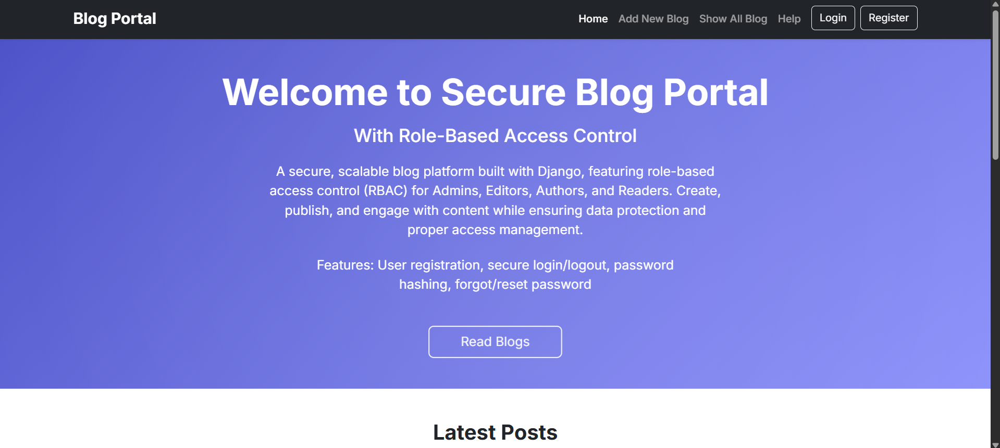
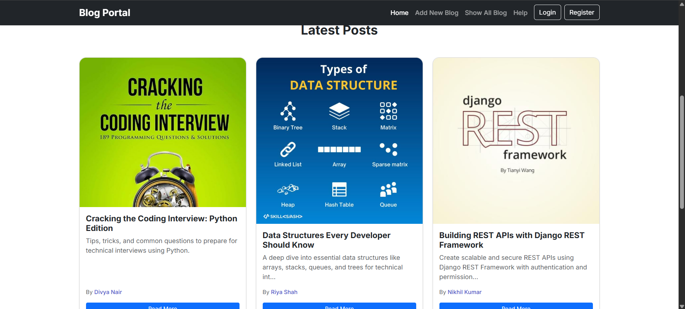
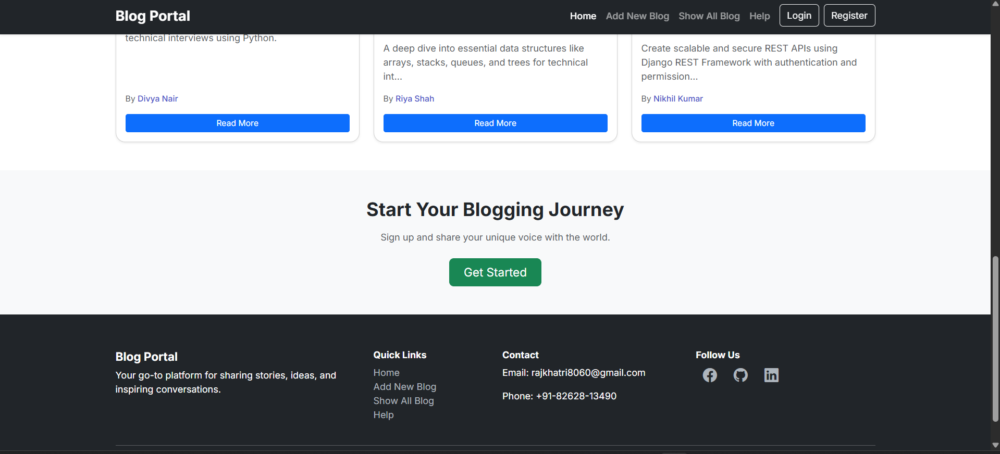
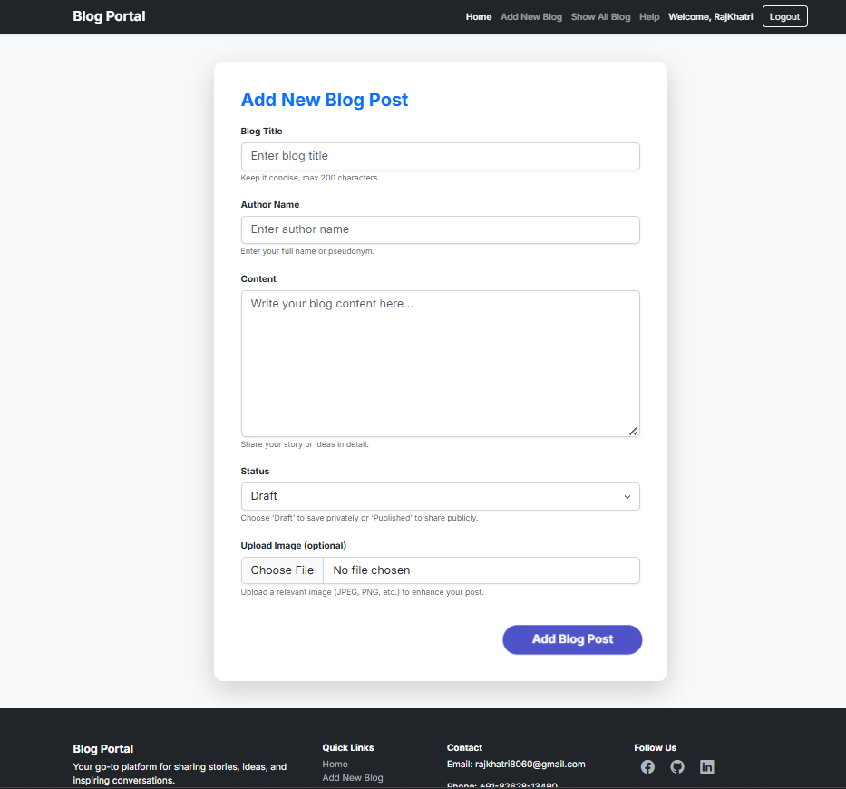
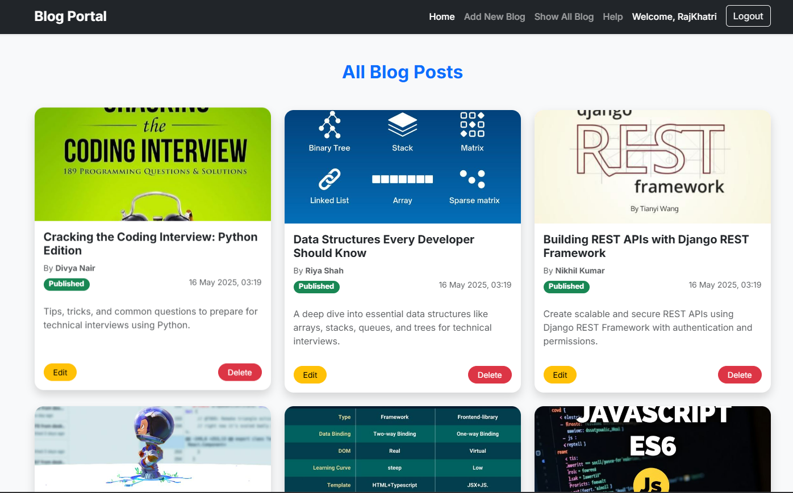
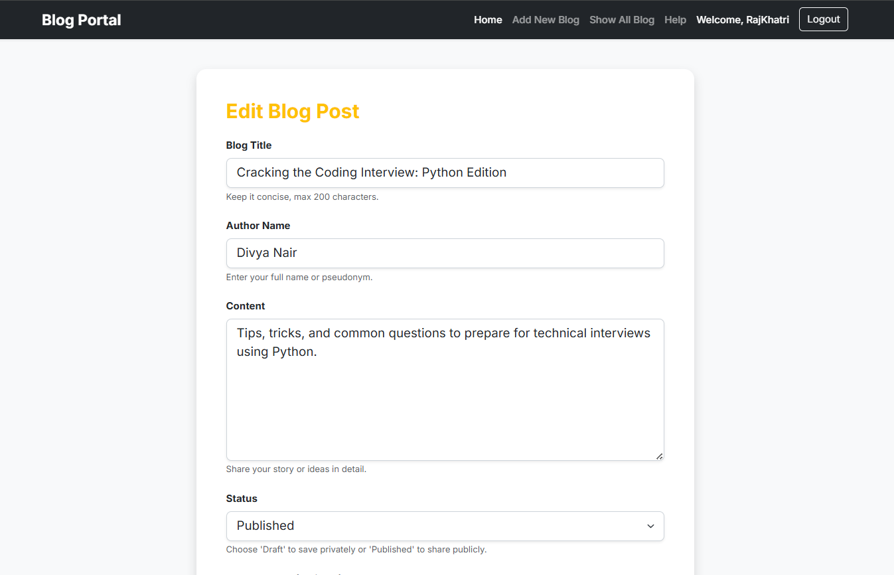
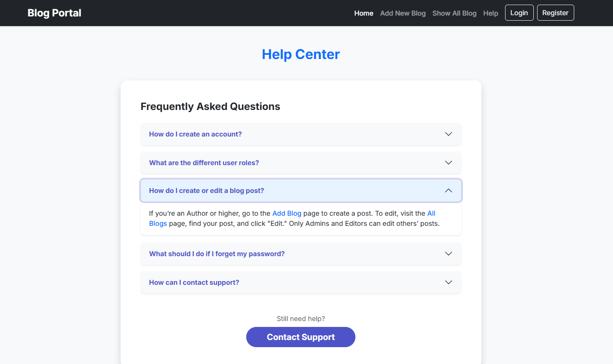
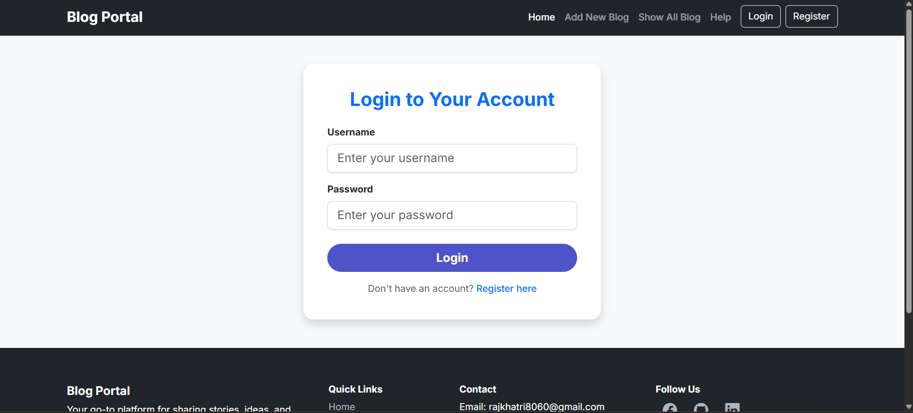
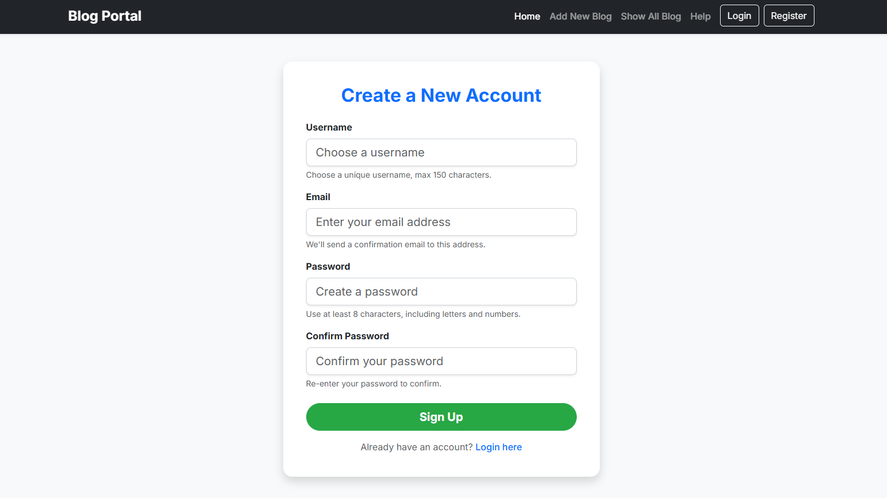
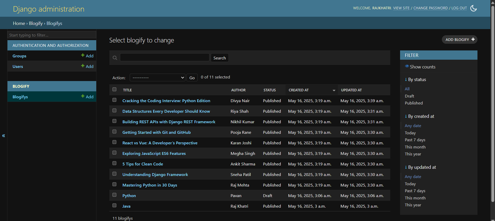

🔐 Secure Blog Portal
A secure, user-friendly blogging platform built with Django, enabling users to create, edit, delete, and manage blog posts with robust authentication and authorization.

🌐 Live Demo
🔗 Add your deployment URL here when available

📸 Screenshots
### 🏠 Home Page  

### ➕ Add Blog

### 📄 ShowBlog

### ✏️ EditBlog

### ❓ Help

### 🔐 Login

### 🧑‍💻 Register

### 🛠️ Administrations

🔍 Features

🔐 Secure User Authentication (Signup, Login, Logout)

✍️ Create, Edit, and Delete Blog Posts

📋 View list of all blog posts with pagination

📝 User profile management

🛡️ Authorization: Only authors can edit or delete their posts

🧰 Admin Panel for managing users and posts

📨 Contact form integration (optional)

🛠️ Tech Stack

Backend: Python, Django

Frontend: HTML5, CSS3, Bootstrap

Database: SQLite (default, configurable to MySQL/PostgreSQL)

Other: Django Admin, Django Forms, Authentication System

📁 Project Structure
Secure_Blog_Portal/
├── blog/
│ ├── migrations/
│ ├── templates/blog/
│ ├── static/
│ ├── admin.py
│ ├── models.py
│ ├── views.py
│ ├── urls.py
│ └── forms.py
├── Secure_Blog_Portal/
│ ├── settings.py
│ ├── urls.py
│ └── wsgi.py
├── manage.py
├── db.sqlite3
└── requirements.txt

🚀 Getting Started
🔧 Prerequisites
Python 3.7+

pip package manager

💻 Installation Steps
# 1. Clone the repo
git clone https://github.com/khatri-raj/Secure_Blog_Portal.git
cd Secure_Blog_Portal

# 2. Create and activate virtual environment
python -m venv myenv
myenv\Scripts\activate       # Windows
# source myenv/bin/activate  # Mac/Linux

# 3. Install dependencies
pip install -r requirements.txt

# 4. Apply migrations
python manage.py makemigrations
python manage.py migrate

# 5. Create superuser (admin)
python manage.py createsuperuser

# 6. Run the server
python manage.py runserver

# Visit: http://127.0.0.1:8000
🤝 Contributing
Contributions are welcome! Please open an issue to discuss major changes before submitting a pull request.

📫 Contact
Raj Khatri
Email: rajkhatri8060@gmail.com
GitHub: @khatri-raj
